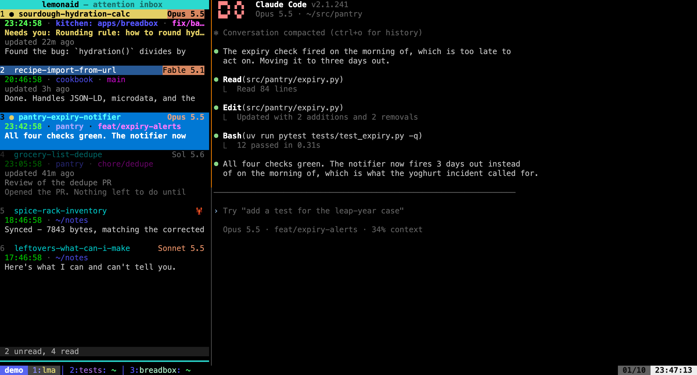
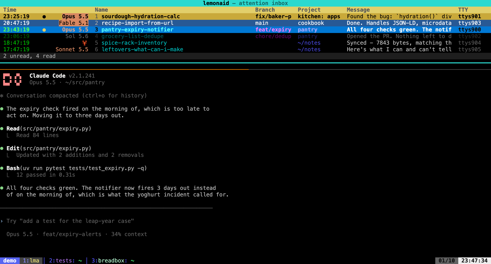

# 🍋🥤 lemonaid

Monitor progress of and switch between lemons (go on... say 'LLMs' three times fast)
running in the terminal.



## An inbox that stays in view

The inbox can live in a pane that follows you across every window and session
switch, so it is ambient rather than something you summon:

```bash
lemonaid tmux scratch --follow          # left or top, from config
lemonaid tmux scratch --flip            # move it to the other edge
```

On the left, above, each session is a card: name, then time, cwd and branch,
then the message wrapped over as many lines as the pane can spare. With
[`brief_status`](docs/config.md#tui) on, a card also shows its lemon's brief:
a red headline and what it needs from you when `alert`, yellow when `blocked`,
green when `merge`, brown when `review`, blue when `done`, dimmed while `waiting`.

Across the top, it has room for columns instead, one row per session, with
`alert` rows red, `blocked` rows amber, `merge` rows green, `review` rows brown,
and `done` rows blue:



The inbox's title turns teal while it has keyboard focus, and in the top strip
the column header turns the unread marker's colour while something is waiting
for you. `prefix+l` toggles focus between the inbox and your work; `q` parks it
until you want it back.

To see it with invented sessions before wiring up your own:

```bash
uv run scripts/demo-inbox.py            # a throwaway tmux server, own inbox
uv run scripts/demo-inbox.py --kill
```

The screenshots here come from that demo:
`uv run scripts/demo-inbox.py --no-attach` (add `--top` for the strip), then
`uv run scripts/demo-screenshot.py docs/images/inbox-left.png`.

Full setup, keybindings, and behaviour: [docs/tmux.md](docs/tmux.md).

## How It Works

Lemonaid has two parts: **hooks** that fire when your lemons need attention, and a **TUI** (`lma`) that shows what's going on and lets you jump to sessions.

1. You add hooks to Claude Code, Codex CLI, and/or OpenCode (see [Integrations](#-integrations) below)
2. When a session stops or needs input, the hook writes a notification to a local SQLite database
3. The `lma` TUI displays active notifications, watches transcripts for live activity, and auto-archives sessions when they end
4. When you select an active session, you are taken directly to that pane/tab in `tmux`/WezTerm
5. Over time, archived sessions accumulate into a searchable **session history** — press `h` to browse past sessions across all projects and resume them

The TUI doesn't need to be running for notifications to arrive (hooks write directly to the DB), but it does need to run for live activity updates and automatic archiving.

## Features

- **Notification inbox**: Track which [Claude Code](docs/claude.md), [Codex CLI](docs/codex.md), [OpenClaw](docs/openclaw.md), and [OpenCode](docs/opencode.md) sessions need your attention, and what they're doing as they do it
- **Terminal integration**: Hit enter to jump directly to the waiting session's pane (supports [`tmux`](docs/tmux.md) and [WezTerm](docs/wezterm.md)). If the session has since died, it is resumed in a new pane in the same directory rather than the jump failing
- **Session history & resume**: Browse archived sessions across all projects, filter by name/cwd/branch, and resume directly or copy the command
- **[Places](docs/places.md)**: Spin up a directory and its session in one command, and tear both down in one command. What "spin up a directory" means is a shell command you configure per repo, so worktrees (or whatever else you use) stay out of lemonaid's model
- **Briefs**: `b` on a session shows its identity, `Status:`, what it needs from you, and the rest of `## Now` beside the lemon or in a tmux popup, without switching to it, with the live state of any PR the brief names when `[brief] pr_state` is configured. `lemonaid brief show` prints the same from anywhere
- **[Lemon messages](docs/messages.md)**: Each brief carries a stable ID for its file inbox. Send Markdown by ID, channel, or brief name with `lemonaid tell`; receive one with `lemonaid inbox next --self` or wait with `lemonaid inbox watch --self`. Codex lemons get messages queued into their threads by a self-starting delivery service; an optional Stop hook keeps each Claude lemon's waiter armed
- **[Parent links](docs/lineage.md)**: Record which lemon handed another its work, by Lemon-ID, with `place open --parent self` or `lemonaid lemon parent`. `lemon children` lists a parent's children with their brief status, and `tell --parent` and `tell --child` message along the links
- **[Watches](docs/watch.md)**: `lemonaid watch doc`, `watch pr`, and `watch file` wait, at no token cost, for a Relay Comment on a document, activity on a GitHub PR, or a changed file, then wake the lemon: a Claude background task exits or a Codex thread gets a queued message. OpenClaw sessions get an agent turn for document comments
- **[Skills](docs/skills.md)**: `lemonaid skills install` installs `watch-doc` and `watch-pr` skills for Claude Code and Codex, with your own additions appended from `~/.lemons/skills/<name>/overlay.md`
- **[Brief status cards](docs/config.md#tui)**: Opt in with `[tui] brief_status = true` to color cards by attached brief status, show what a lemon needs from you or is waiting on, and flag stale briefs
- **[Auto-read](docs/config.md#inbox)**: Regexes in `[inbox] auto_read` leave a session read when its turn ends with a matching final message, so routine turns don't ask for attention
- **Pins**: Hold a session at the top of the list, in an order you choose
- **Snooze**: Hold a session that needs attention "but not yet" until a time you pick, with a snoozed list so nothing goes missing
- **Undo**: Reverse an accidental archive, mark-read, snooze, or rename - multi-level, with a toast naming what changed
- **Bootstrap**: `lemonaid claude bootstrap` imports historical Claude sessions from before lemonaid was installed into the archive
- **Always-visible sidebar** (`tmux`): [Follow mode](docs/tmux.md#follow-mode) keeps the inbox in view across every window and session switch, on the left or across the top. Sessions render as cards when the pane is too narrow for columns. Without follow mode it is still a scratch pane you toggle with a keybinding, with no startup delay
- **Brief beside the lemon** (`tmux`): When the scratch pane follows on the left, `b` replaces the inbox with the selected lemon's brief and keeps keyboard focus there. `prefix+b` opens the brief from the lemon and focuses the scratch pane; switching away restores the inbox
- **Auto-refresh TUI**: See new notifications appear without losing your place

### Assorted helpers
- **Claude statusline**: Colorful statusline showing time, elapsed, git branch, context %, vim mode
- **`tmux` session templates**: Spin up new named workspaces with a predefined window layout
- **`tmux` window status formatting**: An optional `tmux` integration to keep your status bar sane

## Installation

```bash
git clone https://github.com/petergaultney/lemonaid.git
cd lemonaid

# Install globally with uv
uv tool install --editable .

# For development
uv sync
uv run pre-commit install
```

On macOS, check the [tmux server setup](docs/tmux.md#tmux-server-setup) before
using follow mode, especially the file-descriptor limit and window options.

Before running or extending the test suite, read [docs/testing.md](docs/testing.md),
especially its watcher-isolation safety invariant.
For this repo's multi-lemon merge and live-install workflow, see
[docs/development.md](docs/development.md).

## 🍋 Integrations

### Claude Code

Add hooks to `~/.claude/settings.json`:

```json
{
  "hooks": {
    "UserPromptSubmit": [{ "hooks": [{ "type": "command", "command": "lemonaid claude submit" }] }],
    "Stop": [{ "hooks": [{ "type": "command", "command": "lemonaid claude notify" }] }],
    "PermissionRequest": [{ "matcher": "AskUserQuestion", "hooks": [{ "type": "command", "command": "lemonaid claude notify" }] }],
    "Notification": [{ "matcher": "permission_prompt", "hooks": [{ "type": "command", "command": "lemonaid claude notify" }] }]
  }
}
```

Features: sessions appear in the inbox the moment a prompt is submitted (`UserPromptSubmit`), questions asked mid-turn with `AskUserQuestion` notify you (`PermissionRequest`), auto-dismiss via transcript watching, live activity updates, binary patch for faster notifications.

**Full documentation**: [docs/claude.md](docs/claude.md) | [Binary patch](docs/claude-patch.md)

### Codex CLI

Add to `~/.codex/config.toml` **at the very top** (before any `[table]` headers):

```toml
notify = ["lemonaid", "codex", "notify"]
```

Features: auto-dismiss via session watching, live activity updates.

**Full documentation**: [docs/codex.md](docs/codex.md)

### OpenClaw

Register from within an OpenClaw TUI session:

```
!lemonaid openclaw register
```

Features: turn-complete detection, live activity updates, auto-dismiss on user input.

**Full documentation**: [docs/openclaw.md](docs/openclaw.md)

### OpenCode

Add this plugin at `~/.config/opencode/plugins/lemonaid.js` (or `.opencode/plugins/lemonaid.js` in a project):

```javascript
export const LemonaidPlugin = async ({ $ }) => ({
  event: async ({ event }) => {
    if (event.type === "session.idle" || event.type === "permission.asked") {
      await $`lemonaid opencode notify ${JSON.stringify(event)}`
    }
  },
})
```

Features: idle/permission notifications via plugin hooks, auto-dismiss via session DB watching, live activity updates.

**Full documentation**: [docs/opencode.md](docs/opencode.md)

## Terminal Setup

- **`tmux`** (3.0 or later; follow mode needs 3.6): See [docs/tmux.md](docs/tmux.md) for pane switching, back navigation, session templates, and window colors
- **WezTerm**: See [docs/wezterm.md](docs/wezterm.md) for workspace/pane switching setup

## Usage

```bash
# Open the inbox TUI
lma

# Or via the full CLI
lemonaid inbox

# List notifications (non-interactive)
lemonaid inbox list
```

### Session order

The inbox and the scratch sidebar list sessions in the same order:

1. Pinned sessions, in the order you put them.
2. Sessions whose attached brief says `alert`: your move, and harm grows while it waits.
3. Sessions whose brief says `blocked`: a decision, answer, or review for you.
4. Sessions whose brief says `merge`: only your merge is left.
5. Sessions whose brief says `review`: a teammate's approving review comes before your merge.
6. Sessions whose brief says `done`.
7. Every other unread session.
8. Every other read session: `working`, `waiting`, or no brief.

With [`[tui] fold_statuses`](docs/config.md#folding-sessions-by-brief-status) set,
read sessions of those statuses fold into one line at the bottom, which `w` opens.

Within each group other than the pins, unread comes first, then newest first.

### TUI Keybindings

| Key | Action |
|-----|--------|
| `Enter` | Switch to the session's pane |
| `1`-`9`, `0` | Switch to that row |
| `u` | Jump to the oldest unread session |
| `m` / `M` | Mark as read / unread |
| `a` | Archive |
| `s` / `S` | Snooze / list snoozed |
| `p` | Pin below the other pins, or unpin; `Shift`+`↑`/`↓` moves a pin |
| `b` | Show the session's brief |
| `z` | Undo the last inbox change |
| `h` | Session history (`Enter` resumes, `c` copies the resume command) |
| `f` | Move the scratch pane between top and left |
| `?` | Show the key reference |
| `q` / `Escape` | Quit |

The full list, including rename, history filtering, and the brief view's own keys, is in [docs/keybindings.md](docs/keybindings.md), along with how to rebind them.

### Programmatic Access

For JSON output and programmatic access (useful for lemons), see [docs/for-lemons.md](docs/for-lemons.md)
— or run `lemonaid for-lemons`, which prints the same guide from any install.

## Configuration

Config file: `~/.config/lemonaid/config.toml` — see [docs/config.md](docs/config.md) for the full reference.

- [docs/keybindings.md](docs/keybindings.md) - Customize TUI keybindings
- [docs/tmux.md](docs/tmux.md) - tmux integration and session templates
- [docs/wezterm.md](docs/wezterm.md) - WezTerm integration

## Architecture

- **inbox**: SQLite-backed session status storage with [Textual](https://textual.textualize.io/) TUI
- **claude**: Claude Code hook integration with transcript watching
- **codex**: Codex CLI hook integration with session watching
- **openclaw**: OpenClaw integration with turn-complete detection
- **opencode**: OpenCode integration with plugin events and live activity watching
- **brief** and **messages**: attached briefs, their popup and sidebar views, and the per-lemon file inboxes behind `lemonaid tell`
- **places**: per-repo hooks that create and remove directories, and the tmux sessions opened in them
- **tmux** / **wezterm**: pane switching, the scratch pane and follow mode, session templates
