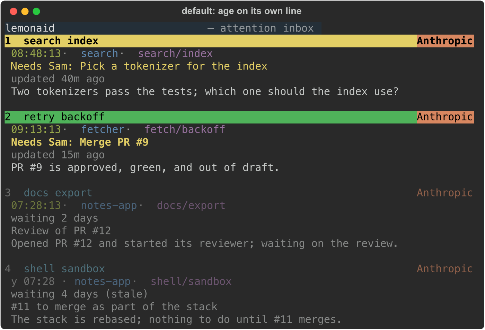
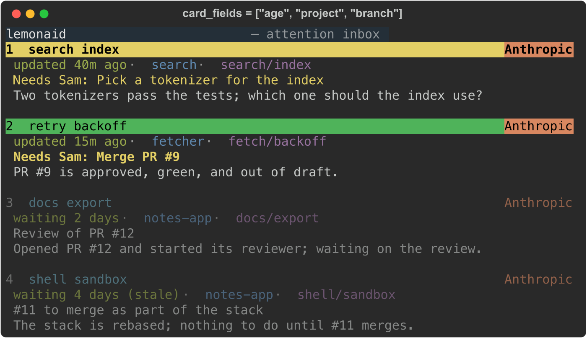
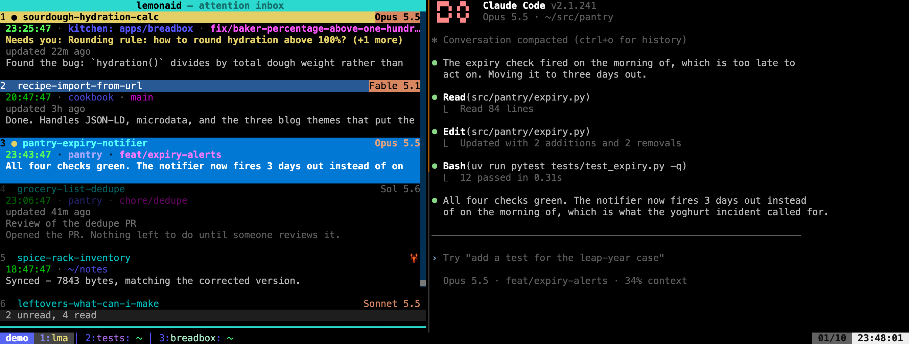
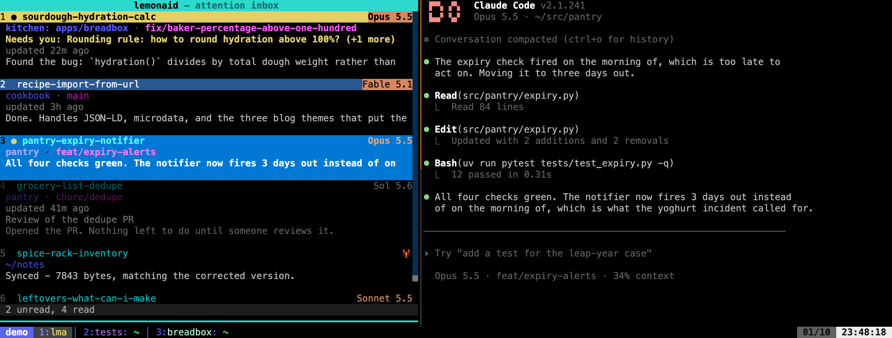

# Configuration Reference

Config file: `~/.config/lemonaid/config.toml`

Created automatically on first run, or with `lemonaid init`.

## `[backends.<name>]`

Per-backend configuration. `<name>` is the backend prefix (`claude`, `codex`, `openclaw`, `opencode`, or any custom backend).

| Key | Default | Description |
|-----|---------|-------------|
| `resume_command` | *(built-in per backend)* | Shell command template for resuming a session. Placeholders like `{session_id}` are filled from notification metadata, then the result is `shlex.split` into argv. |
| `submit_key` | `"Enter"` | Key lemonaid sends when submitting text to a running Claude or Codex composer. `"C-Enter"` sends literal CSI-u Ctrl+Enter bytes through tmux; use it when Enter inserts a newline in the harness. |

Built-in defaults (used when no `resume_command` is configured):

| Backend | Default |
|---------|---------|
| `claude` | `lemonaid claude resume {session_id}` |
| `codex` | `codex resume {session_id}` |
| `openclaw` | `openclaw --session {session_key}` |
| `opencode` | `opencode --session {session_id}` |

`lemonaid restore` starts a Claude or Codex lemon on a prompt by adding it as the last argument, so a
custom `resume_command` for either must take a prompt there, as `claude --resume` and `codex resume` do.

To add flags to Claude resumes:

```toml
[backends.claude]
resume_command = "lemonaid claude --allow-dangerously-skip-permissions --resume {session_id}"
```

`lemonaid claude` followed by a flag runs `claude` with the same arguments,
after changing to the project directory recorded for the `--resume` session.
When that directory is gone, it uses the nearest surviving parent and resumes
from the saved transcript path. Configured flags and any first prompt are kept.
Modern Claude versions can also resolve a session ID across projects directly.
Codex resumes from a surviving parent with `--cd` when its directory is gone;
an existing `--cd` or `-C` in its configured resume command takes precedence.
If that configured directory is gone too, its nearest surviving parent is used.

When both harnesses use Ctrl+Enter to submit, configure both backends:

```toml
[backends.claude]
submit_key = "C-Enter"

[backends.codex]
submit_key = "C-Enter"
```

This setting applies to lemonaid's interactive submissions, including Claude's optional
`tmux new --rename` and handoff recovery prompts. It does not change the Enter used to
start shell commands. Configure each harness's own keybindings to submit with Ctrl+Enter
before enabling it here; see [Claude's keybindings](https://code.claude.com/docs/en/keybindings)
and [Codex's TUI keymap](https://learn.chatgpt.com/docs/config-file/config-basic#tui-keymap).

## `[wezterm]`

See [wezterm.md](wezterm.md).

## `[tmux-session]`

| Key | Default | Description |
|-----|---------|-------------|
| `scratch_position` | `"left"` | Which edge the scratch pane starts against: `top` or `left`. Move it at runtime with `--flip` or `f` in `lma`; that choice is remembered per tmux server. |
| `scratch_height` | `"10"` | Height of the scratch pane on top, in rows. |
| `scratch_width` | `"45"` | Width of the scratch pane on the left, in columns. |
| `follow_scratch` | `false` | Bootstrap follow mode for new tmux servers. When the scratch pane is first toggled on a server, this determines whether follow is enabled by default. See [tmux.md](tmux.md#follow-mode). |
| `resume_window` | `0` | 0-based index into the template window list: which window to replace with the resume command when spawning a tmux session from history (`T`). Set to `1` if your lemon is in the second tab. |
| `codex_writable_roots` | `[]` | Directories a Codex lemon may write, in addition to the lemonaid database and state directories, which are always included. Set it to wherever your lemons write documents outside their workspace, such as a review-docs folder. Passed as `sandbox_workspace_write.writable_roots`, so it takes effect only when your `codex` template runs the `workspace-write` sandbox, and it replaces any `writable_roots` in Codex's own config. `~` is expanded. |
| `harness_window` | `resume_window` | 0-based template window whose command accepts `place open --prompt`. Set it separately only when new-session prompts and resumed sessions belong in different windows. |

### `[tmux-session.templates]`

See [tmux.md](tmux.md).

Name each template after the harness its `harness_window` starts, such as `claude` and
`codex`. `place open` and `lemon start` take that name as `--harness`: `place open feat/thing
--harness codex` selects the `codex` list below, and `lemon start SESSION:WINDOW --harness codex`
runs that list's `harness_window` command in another window of an existing session.

`default` is the template used when `--harness` is left out. Set it to another template's
name, as below, or give it a window list of its own. A `default` that names a missing template,
or itself, is reported when the config loads, and a launch without `--harness` then fails.

A Codex line needs `--no-daemon` for `--brief` to work with either command: a Codex
on the shared app-server can't be matched to its window.

```toml
[tmux-session]
resume_window = 1
# harness_window = 1  # implied by resume_window when omitted

[tmux-session.templates]
claude = [
    "emacsclient -nw .",
    "lemonaid claude patch && claude --remote-control --thinking-display summarized",
    "",
]
codex = ["emacsclient -nw .", "codex --no-daemon", ""]
default = "claude"
```

## `[tmux-window]`

| Key | Default | Description |
|-----|---------|-------------|
| `named_processes` | `[]` | Console-script or application names to show by themselves in the tmux status line when they run behind Python, Node, or another recognized interpreter. |

For example, to show `mops-console` instead of its working-directory name:

```toml
[tmux-window]
named_processes = ["mops-console"]
```

The name may come from the interpreter's command line or the pane title. Add
`#{pane_pid}` as the final `lemonaid-tmux-window-status` argument, as shown in
[the tmux setup](tmux.md#tmuxconf-setup), for command-line detection.

## `[tui]`

| Key | Default | Description |
|-----|---------|-------------|
| `transparent` | `false` | Use ANSI colors instead of RGB, allowing terminal transparency to work. |
| `refresh_interval` | `0.33` | Seconds between inbox refreshes. |
| `card_unread_style` | `"dot"` | Card-layout unread treatment: `"dot"`, or `"bar"` for a yellow title bar and provider-coloured model badge. |
| `card_fields` | `["time", "project", "branch"]` | What a card's second line shows, in order: any of `time`, `age`, `project`, `branch` and `cwd` (see below). |
| `brief_status` | `false` | Color sessions with attached briefs by their `Status:`; cards also show brief age. |
| `mid_turn_working` | `false` | Draw a session that is mid-turn as `active` even when its brief sets a status, in the place its brief gives it (see below). |
| `brief_names_in_inbox` | `false` | Show each attached brief's name after its session name (`lemonaid HQ · BlessBar`), in both layouts. Sessions without an attached brief have none. |
| `project_name_colors` | `false` | Give project labels stable colors in both inbox layouts, chosen like tmux window labels from the generated whole-hue-wheel palette (see [Name colors](tmux.md#name-colors)) with directory overrides. Timing labels become neutral grey. |
| `group_colors` | `{}` | A table of group name to `#rrggbb`, used instead of the group's automatic colour. See [Group colors](#group-colors). |
| `active_row_color` | *(unset)* | Override the selected inbox row background with any Textual colour, applied at startup. By default, dark themes use a deeper blue; light themes keep their current highlight. |
| `fold_statuses` | `[]` | Brief statuses whose sessions fold into one group at the bottom of the list (see below). |
| `focus_color` | `"#2bd9cf"` | The scratch pane's title bar and bottom edge while its tmux pane will receive keys. Any Textual colour; the title text turns black or white to contrast with it. |
| `notes` | *(unset)* | A Markdown file to show under the sessions when they are cards (see below). |

With `brief_status = true`, a card whose session has an attached brief is drawn
from that brief. A brief without a status is drawn as its lemon's own state
(`docs/brief-status.md`): `active` while it is mid-turn, `idle` between turns,
and `deaf` or `dead` when a message sent to it would not be read.

- `alert` fills the headline red, `blocked` yellow, `merge` green, `approve`
  purple, `review` brown, `done` blue, and `running` teal. On each, the model
  label becomes a badge in its provider colour.
- A read `idle` card is dimmed. An unread one is not.
- The age line names the status and how long it has held it: `idle 1h` (since
  the lemon's last turn ended), `active just now`, `done 1m ago`, `blocked 2h
  ago`. A set status counts from when lemonaid first saw it, so edits to `## Now`
  or to the file by anything else don't reset it.
- `active` keeps the ordinary read style.
- `deaf` or `dead` comes before the age in red, on a card with a status other
  than `done` too: a `blocked` lemon that has exited will not see the answer.
- Under the name and location come the first line of `Needs` from `## Now`,
  with its label (`Needs you: ...`) in the attention colour, then the age line,
  then, for `running`, the first line of `Running`, and for
  a brief without a status between turns, the first line of `Waiting on`.
- Unread is always the dot, even with `card_unread_style = "bar"`: the bar is
  only for cards without a brief.
- With `mid_turn_working = true`, while a read session is mid-turn, its card
  is drawn as `active` whatever its brief says, except `running`: no status
  fill and no `Needs` line, with the brief's status in its status color in the age line
  (`blocked 3m ago`). Its brief view still shows the need and its
  questions, dimmed, and `a` still answers them. The card keeps the place in the list, and the fold, that its brief's
  status gives it, so a lemon doesn't jump around as its turns start and end.
  The brief's status applies again when the turn ends. A lemon rewrites
  `Status:` late in a turn, so this keeps a lemon already working on your
  answer from still reading `blocked`. A turn whose transcript has been
  silent for 20 minutes counts as over. Off, cards ignore turns entirely.

In the column layout, an `alert` row fills red, a `blocked` row amber (deeper
than the header's unread yellow), a `merge` row green, an `approve` row purple, a `review` row brown, a `done` row blue, and a `running` row teal, with
the model as the same badge, and a read `idle` row dims. The green bar that
marks the current session stays green. Rows carry no age, `Needs`, `Running` or
`Waiting on` lines; there is no room for them.

Sessions without an attached brief look the same whether or not this is set.
Sessions sort by brief status in both layouts either way; see
[Session order](../README.md#session-order).

```toml
[tui]
brief_status = true
```

### Folding sessions by brief status

`fold_statuses = ["idle"]` takes read sessions whose attached brief sets no
status out of the list, between turns, and shows one line at its bottom in their
place: `▸ idle (4) · w to show`. A lemon comes out while it is `active`, as it
used to when it set `working`, and while it is `deaf` or `dead` unless those are
listed too. `waiting` and `working`, from before lemonaid derived them, mean
`idle` and `active`. `w` (the `fold` key) opens the group, listing those
sessions at the bottom of the list, and closes it again. It works the same in the
column layout and the sidebar.

A folded session comes back into the list while it is unread or while its tmux
pane is focused, and a pinned session never folds. When focus moves away, the
session folds again on the next refresh, unless the cursor is on its card: then
it stays until the cursor leaves. Focusing the pane of an archived lemon
whose harness is still running brings it back from history, read. Any status
can be listed; the default folds nothing.

```toml
[tui]
fold_statuses = ["idle"]
```

With `card_unread_style = "bar"`, an unread card without a brief (see above)
drops the dot and paints its first line instead. The selector and title use a lemon-yellow background with
black text; the model label uses its provider colour as the background, with
one coloured space on each side. Session emojis appear at the right end of the
second line, just before the pin marker when present. A green selected-session
bar remains green.

```toml
[tui]
card_unread_style = "bar"
```

A card's second line says where a session is working. By default that's the
time of its last message, its project, and its branch. The project is the
`[[places.roots]]` entry its cwd sits under, named by the root's `name` or its
directory. A [per-root `project_name` hook](#project-names-within-a-root) can
replace that label. The `Area:` from its brief follows if it has one
(`ds-monorepo: apps/unified-asset`). Outside every root, the project is the
cwd's directory name. With no root and no branch either, the line shows the
cwd as before. When the line doesn't fit, the branch is cut first, then the
area, and then the time is dropped, so the project's name stays whole wherever
it fits on its own.

### Group colors

A group's header, arrow and rail take a colour from the same generated palette as project labels (see [Name colors](tmux.md#name-colors)). Each group starts from the slot its name hashes to. Groups are taken in name order, and one whose slot is within a perceptual distance of 0.08 (OKLab) of a colour already given out moves to the nearest slot that isn't, so no two groups share a look. Nothing is stored: the colours depend only on the current set of group names.

To choose one, set it by name. A group set this way keeps that colour, and the others keep clear of it:

```toml
[tui.group_colors]
oria = "#e0a227"
```

A value that isn't `#rrggbb` is reported at start-up and ignored.

Set `project_name_colors = true` to color each project label with the same
selection used by tmux window labels: a stable hash into the generated palette,
with the same named directory overrides. The same name keeps the same color
across runs; this applies to the project label, not the area or cwd fallback.

The `age` field puts the brief's age on this line instead of a line of its own:
`waiting 2 days` or `updated 40m ago`, with `(stale)` when it applies. A card
without a brief shows the time there. Unlike the time, the age is never dropped
to make room: on a card too narrow for both, the project is cut instead.
When a session is working mid-turn, the brief's held status keeps its status
color both on its own line and before an inline age.

```toml
[tui]
card_fields = ["age", "project", "branch"]
```

| Default | With `age` |
|---|---|
|  |  |

The column layout's directory column shows the project too, under a
`Project` header, while `card_fields` includes `project`. History and the
snoozed list keep the cwd.

```toml
[tui]
card_fields = ["project", "branch"]   # drop the time, which mostly repeats the brief's age
```

| Default | Without `time` |
|---|---|
|  |  |

An unknown name is skipped with a warning when the config loads.

### Notes under the sessions

`notes` names a Markdown file that stays in view under the cards in a sidebar,
for anything you want in sight while you work: key hints while you learn tmux,
a checklist, a reminder. Give an absolute path or one that starts with `~`. A
relative path is read from the directory `lma` started in.

```toml
[tui]
notes = "~/.config/lemonaid/notes.md"
```

```markdown
**tmux** · prefix is `Ctrl-b`

- `c` new window · `n` next · `w` pick
- `%` split side by side · `"` stacked
- `z` zoom pane · `[` scroll, `q` to stop
```

- The notes take the height of their content, up to 40% of the space under the
  title bar. Longer notes scroll inside their panel with the mouse wheel; the
  panel never takes keyboard focus, so the keys keep acting on the list. Cards
  size themselves to the rest.
- An edit to the file shows on the next refresh. You do not need to restart
  the pane.
- `N` hides the notes and shows them again. The key is bound only when
  `notes` is set. A restarted pane shows them again.
- A top strip, which has columns rather than cards, never shows the notes. A
  brief that replaces the sidebar hides them until the inbox comes back.
- A path that cannot be read shows `No notes at` and the path.

### `[tui.backend_labels]`

Override the label shown for each backend in the session list when its model is not yet known. Keys are backend names (`claude`, `codex`, `openclaw`); values are any string. Claude, Codex, and OpenClaw default to `Anthropic`, `OpenAI`, and `🦞`; unknown backends display their name as-is.

```toml
[tui.backend_labels]
claude = "Claude"
codex = "Codex"
openclaw = "🦞"
```

When the session transcript names a recognized model family, its friendly name and version replace the backend fallback: for example, `Opus 5.5`, `Fable 5.6`, or `Sol 5.6`. Labels are right-aligned and use the provider's color.

### `[tui.context_threshold]`

Show how much context each Claude and Codex lemon has used, before its model label: `42%  Opus 5.5`. The number is a percentage of the threshold you set, not of the model's whole window, so 100% means the lemon has reached the point you care about. Its colour runs from deep purple at 0% through blue, green and yellow to red at 100%, then on to magenta. On a row or card filled by brief status, the colour becomes the background of the reading and one cell of padding on each side, as the model label becomes a badge. The two cells between them are always there, so the number sits in the same place on a filled row as on a plain one.

Nothing is shown unless you configure it. Keys are a backend (`claude`, `codex`) or an exact model id as its transcript records it (`claude-opus-5-5`, `gpt-5.6-sol`); a model's entry wins over its backend's, and a backend with neither shows no reading. Each value is a share of the window, as a string like `"50%"`, or a number of tokens, written as `650000`, `"650k"` or `"0.65M"`. A quoted number with no unit is ignored with a warning, since `"50"` could mean either. `0` hides the reading. Configuring any entry widens the model column by five cells.

```toml
[tui.context_threshold]
claude = "50%"
codex = "0.65M"
"claude-haiku-5-5" = "80%"
```

What each harness reports:

- **Codex:** each `token_count` event in the rollout gives the tokens the last request sent and the model's context window.
- **Claude:** the transcript gives each request's input tokens, including cached ones, but not the window. `lemonaid-claude-statusline` saves the window Claude Code passes it, per session, under the state directory. Without that statusLine command, a share like `"50%"` has no window to apply to and the row shows nothing; a token count still works.
- OpenClaw and OpenCode rows show no reading.

The reading is the newest request's input, so it updates when the lemon next calls the model, and drops after a compaction or `/clear`.

### `[tui.keybindings]`

`answer_yes = "Y"` immediately sends `Yes, approved` for the selected brief question.
`search = "/"` opens inbox search with archive matches below a divider, and filters history.
See [keybindings.md](keybindings.md) for the other keys and conflict warnings.

## `[brief]`

| Key | Default | Description |
|-----|---------|-------------|
| `pr_state` | `""` | Shell command that prints a PR's state for `{ref}`; unset shows PR numbers without a state. |
| `pr_url` | `""` | Shell command that prints a PR's URL for `{ref}`, so `brief pr add` takes a number; unset, it needs the URL. |
| `name` | `""` | Shell command that prints a new lemon's name; unset uses a random two-word WordyBin. |
| `vaults` | `[]` | Obsidian vault directories; a bare `.md` path under one opens in Obsidian. |

The brief popup and sidebar run `pr_state` for each `PR #N` or pull-request URL
in a brief (up to three), in the lemon's place, so a bare number resolves against
that directory's repository. `{ref}` is the number or URL, shell-quoted. The
first word printed must be `open`, `draft`, `merged` or `closed`; anything else,
a non-zero exit, or more than 5 seconds shows no state. lemonaid knows nothing
about the forge, so any tool works. With GitHub's `gh`:

```toml
[brief]
pr_state = "gh pr view {ref} --json state,isDraft --jq 'if .isDraft then \"draft\" else (.state | ascii_downcase) end'"
```

The popup runs it once per open. The sidebar re-renders on a timer, so it caches
each answer for two minutes and fetches in the background.

`pr_url` turns the number given to `lemonaid brief pr add` into the URL its row
links to. It runs in the caller's directory, with `{ref}` the shell-quoted
number, and the first word printed must be a pull-request URL. With `gh`:

```toml
[brief]
pr_url = "gh pr view {ref} --json url --jq .url"
```

`name` names new lemons: the part of a Lemon-ID after the dot, and the name a
lemon signs with. It runs in the caller's directory each time lemonaid needs a
name, including again when the one printed belongs to another lemon, so it
should print a different name each run. The first word printed is the name; it
must be letters, digits, `_` and `-` only. A non-zero exit, nothing printed,
another character, or more than 5 seconds stops the brief from being created.
With `name` set, `brief id --set` takes any such name as written.

```toml
[brief]
name = "shuf -n1 ~/.config/lemonaid/names.txt"
```

`vaults` lists Obsidian vault directories. A bare path to a `.md` file under one,
written from `~` or in full, becomes an `obsidian://open` link to that note, using
the directory's name as the vault name, as Obsidian does. With none configured,
such paths stay plain text; bare URLs are shortened either way.

```toml
[brief]
vaults = ["~/notes", "~/work/kb"]
```

## `[inbox]`

| Key | Default | Description |
|-----|---------|-------------|
| `auto_read` | `[]` | Regexes; a finished turn whose final message matches one leaves its session read. |
| `day_starts` | `"06:00"` | Local time a lemon's day starts; its first turn at or after it is told the date. |
| `snooze_day_starts` | `"09:00"` | Local time a snooze of a day or more ends; not related to `day_starts`. |
| `snooze_presets` | `["30m", "3h", "1d", "4d"]` | The snooze picker's presets, in the `s` key's syntax. |
| `arrange` | `""` | A program `lma` keeps running to order its list and choose what folds; see [arrange.md](arrange.md). |
| `arrange_may_fold_unread` | `false` | Let the arranger fold unread sessions, which otherwise stay in the list. |

When a lemon's turn completes, lemonaid normally marks its session unread. If the
final assistant message of that turn matches one of the `auto_read` patterns,
the session is marked read instead. Patterns match from the start of the message
(Python `re.match`, after leading whitespace), so a convention such as ending
routine turns with a marker line works:

```toml
[inbox]
auto_read = ['^\(quiet\)', '^Nothing new']
```

- Only turn completion consults the patterns. A permission prompt or a question
  from the harness is always unread.
- A turn whose final message can't be found stays unread.
- The session is marked read, never archived or hidden.
- A session you mark unread stays unread until a later turn ends with a match.
- An invalid pattern is skipped with a warning on stderr when the config loads.

Claude sessions are read from the Stop and `idle_prompt` hooks (the final
message comes from the transcript), Codex from `notify`'s
`last-assistant-message`, OpenCode from `session.idle`, and OpenClaw from the
transcript watcher. `lemonaid for-lemons` lists the configured patterns, so
lemons on the machine can learn the convention.

`day_starts` sets when a lemon's day begins. Its first turn at or after that
local time is told the time, weekday and date in one line, and later turns that
day are not. A lemon working from 11pm to 2am hears it once that evening, then
again at its first turn after 06:00. Give an `"HH:MM"` string or a TOML local
time; anything else is reported and 06:00 is used.

```toml
[inbox]
day_starts = "07:30"
```

`snooze_day_starts` is when your own day starts, for snoozing. A snooze in days
or weeks counts mornings at this time: `1d` ends at the next one, so it wakes at
09:00 today if you snooze at 02:00 and 09:00 tomorrow if you snooze at 23:00.
`4d` ends at the fourth, `1w` at the seventh, and `1.5d` counts two mornings.
`morning` is the same as `1d`. Minutes, hours, and anything under a day are
exact. It applies to the TUI picker and to `lemonaid inbox snooze`, and takes
the same formats as `day_starts`.

`snooze_presets` lists what the picker offers below its duration box, in order.
Each entry is anything you could type there; the picker labels it from the
duration (`30 minutes`, `Tomorrow morning, Sat 09:00`, `4 days, Tue 09:00`). An
entry it can't read is reported and skipped, and a list with none left gives the
defaults.

```toml
[inbox]
snooze_day_starts = "08:30"
snooze_presets = ["15m", "1h", "1d", "1w"]
```

## `[[places.roots]]`

Each root declares the shell commands that acquire and release directories under one path; [places.md](places.md) describes them all.

```toml
[[places.roots]]
path = "~/play/lemonaid-wt"
name = "lemonaid"
```

| Key | Default | Effect |
|-----|---------|--------|
| `open_prs` | unset | Shell command printing `<branch> <number> [url]` lines for open PRs; an optional HTTP(S) URL makes the number a terminal hyperlink. Inbox lookups run off the UI thread and refresh every three minutes. |
| `name` | the root's directory name | The default project label for sessions under this root. |
| `project_name` | unset | Shell command mapping `{dir}` to one project name for inbox rows. |

### Project names within a root

Set `project_name` on a root to name projects inside it. The innermost matching
root owns the lookup. The command runs in that root's directory; `{dir}` is the
session's absolute working directory, shell-quoted as one argument. Emit one
non-empty line containing the project name, without terminal formatting.

```toml
[[places.roots]]
path = "~/work/ds-monorepo"
name = "ds-monorepo"
project_name = "python3 ~/.local/bin/project-name.py {dir}"
```

For example, save this as `~/.local/bin/project-name.py` to return the nearest
ancestor with a `pyproject.toml`, relative to the nearest ancestor containing
`.git` (a file or directory). It skips that checkout's top-level `pyproject.toml`.

If no project is found below the checkout top, it uses the first directory
component under the configured root as a project prefix. For a checkout at
`mops/topic`, it looks for `*/mops/pyproject.toml` inside that checkout and returns
its project directory, such as `libs/mops`; without a match, it returns `mops`.
The `main` checkout returns nothing when no project is found. This layout policy
lives in the user's script; lemonaid runs it as an opaque command.

```python
import sys
from pathlib import Path

root = Path.cwd().resolve()
directory = Path(sys.argv[1]).expanduser().resolve()
chain = [directory, *directory.parents]
top = next((p for p in chain if (p / ".git").exists()), None)
if top is not None:
    nearest = next((p for p in chain[: chain.index(top)] if (p / "pyproject.toml").is_file()), None)
    if nearest is not None:
        print(nearest.relative_to(top))
    elif root in top.parents and top.relative_to(root).parts[0] != "main":
        prefix = top.relative_to(root).parts[0]
        project = next(top.glob(f"*/{prefix}/pyproject.toml"), None)
        print(project.parent.relative_to(top) if project else prefix)
```

A result such as `tools/obsidian-relay` replaces `ds-monorepo` in both inbox
layouts, history, and snoozed rows. A brief's `Area:` still follows after a colon;
`project_name_colors` uses the hook's name. Brief documents keep their own labels.

Lookups run off the UI thread, one at a time, at most once per cwd per inbox
process, with a five-second timeout. While pending, or after empty output,
multiple names, decoding errors, or command failure, the row keeps its root
label. Failures are logged and cached too. Restart the inbox to repeat lookups;
there is no on-disk cache. `inbox list` does not render project labels and does
not call the hook.

## Environment variables

| Variable | Effect |
|----------|--------|
| `LEMONAID_DB` | Path to the inbox database, replacing `~/.local/share/lemonaid/lemonaid.db`. A second `lma` pointed at its own file cannot archive rows in your real inbox, which is what makes demos and experiments safe - `scripts/demo-inbox.py` uses it. |
| `LEMONAID_CONFIG` | Path to the config file, replacing `~/.config/lemonaid/config.toml`. |
| `LEMONAID_STATE_DIR` | Directory for scratch-pane and back-location state, replacing `~/.local/state/lemonaid`. |
| `LEMONAID_LEMONS_DIR` | Home of briefs and inboxes, replacing `~/.lemons` (see `docs/home.md`). |
| `LEMONAID_LEGACY_BRIEFS_DIR` | The older home that `lemonaid home migrate` moves, replacing `~/.brief-lemons`. |
| `LEMONAID_BRIEFS_DIR` | One directory of briefs, replacing the home's `brief/`. Pins it: `home migrate` refuses while it is set. |
| `LEMONAID_MESSAGES_DIR` | Root of the lemon message inboxes, replacing the home's `inbox/` (`<briefs dir>/inbox` when `LEMONAID_BRIEFS_DIR` is set). |
| `LEMONAID_CHANNEL` | The channel `lemonaid tell` sends from and the `lemonaid inbox` message commands read for, ahead of the harness session id or tmux pane. |
| `LEMONAID_LOG` | Path of the shared log, replacing `/tmp/lemonaid.log`. The test suite sets it, so test runs stay out of the real log. |
| `LEMONAID_DEBUG` | `1` turns on debug logging in the hook entry points. |
| `LEMONAID_LOG_FILE` | Path to write those debug logs to. |

`scripts/sandbox` sets the first seven, plus a private tmux socket, to run a checkout against a snapshot of your state without touching the real one.

## `[watch.pr]`

`lemonaid watch pr --comments` includes outdated and resolved review threads by default.

| Key | Default | Description |
|-----|---------|-------------|
| `skip_outdated` | `false` | Skip comments in review threads GitHub marked outdated. |
| `skip_resolved` | `false` | Skip comments in resolved review threads. |

```toml
[watch.pr]
skip_outdated = true
skip_resolved = true
```

`--skip-outdated` and `--skip-resolved` override the respective config setting to true.
`--no-skip-outdated` and `--no-skip-resolved` override it to false for one wait.
These filters do not affect submitted review bodies or PR conversation comments.

## `[messages]`

```toml
[messages]
autoresume = "on"  # "off", "claude", or "codex"
autoresume_max = 3  # starts of one lemon allowed within the window
autoresume_window = "20m"
```

When `lemonaid tell` finds that its recipient won't read the message, because its harness exited or it is an idle Claude with no inbox waiter, it starts that lemon on a prompt to read its inbox. `autoresume` limits that to one harness, or turns it off. A lemon whose brief says `done`, or whose inbox row is archived, is never started. A lemon already started `autoresume_max` times within `autoresume_window` isn't started again: the sender is told it is crash-looping, and an alert goes to the inbox. A lemon found dead again within three minutes of a start counts that start twice. See [messages](messages.md#will-it-be-read).

## `[usage]`

Thresholds for [`lemonaid usage --watch`](usage.md).

| Key | Default | Description |
|-----|---------|-------------|
| `step_percent` | `20` | Alert each time usage crosses a multiple of this in any limit window. |
| `pace_over_percent` | `100` | Alert when the pace projects usage past this percentage at the window's reset. |
| `pace_recovered_percent` | 90% of `pace_over_percent` | After an over-pace alert, alert again when the projection falls under this. Must not exceed `pace_over_percent`. |
| `pace_min_elapsed_percent` | `5` | Skip pace alerts until this share of the window has elapsed. |
| `pace_color_ratios` | `[0.8, 1.15, 1.4, 1.8]` | Pace ratios shown as green, yellow, orange and red in the `lemonaid usage` summary. Cyan and blue sit as far below green as orange and red sit above it. Four increasing positive numbers. |
| `poll_seconds` | `30` | How often `--watch` rereads usage. |

```toml
[usage]
step_percent = 10
pace_over_percent = 110
```
