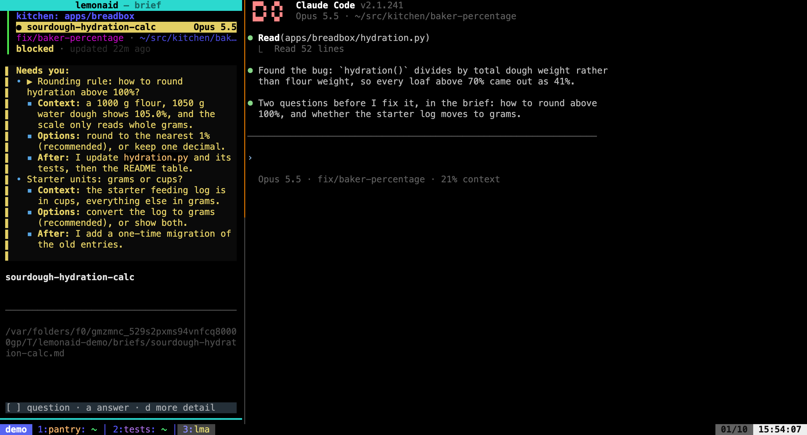

# Places

A **place** is a directory you work in. If you go through a lot of them in a day — git
worktrees, per-branch checkouts, scratch clones — the friction isn't the work, it's the
setup and teardown around it.

Setting one up is two commands (make the directory, then make a session in it), and one of
them blocks while dependencies install. Tearing one down is worse: killing the tmux session
leaves the directory, removing the directory leaves the session, and nothing knows the two
went together.

Places make both one command.

## lemonaid doesn't know what a worktree is

It knows about directories and terminals. Anything that creates or removes directories is a
shell command you declare per root:

```toml
[[places.roots]]
path = "~/work/somerepo"
list = "git -C .bare worktree list --porcelain | grep '^worktree ' | sed 's/^worktree //' | grep -v '/\\.bare$'"
path_of = "wt path {key}"
create = "wt co {key}"
destroy = "wt rm -f {key}"
inspect = "wt status {dir}"

[[places.roots]]
path = "~/play/somethingelse"
# a plain clone - nothing to list, create, or destroy
```

Every command is optional; unset means that capability no-ops for that root. So a normal
clone coexists with a worktree repo, and nothing needs to detect which is which.

`{key}` is whatever your tool names directories by — a branch name, above. lemonaid passes
it through without interpreting it. `{dir}` is an absolute path.

The commands run through a shell, so pipelines work. They come from your own config file,
which is the same trust level as your shell rc.

A root also names the project its places belong to, which brief cards show on their first
line. That's the root's directory name unless you set `name`, which helps when the
directory is named for its layout:

```toml
[[places.roots]]
path = "~/play/lemonaid-wt"
name = "lemonaid"
```

A session outside every root is named for its own directory.



### The protocol is lines

`list` emits one absolute path per line (optionally `path<TAB>label`); `inspect` emits one
short line, or nothing. That's it — no JSON schema to satisfy, which is why the `list` above
is plain `git` rather than anything worktree-tool-specific.

`inspect` decides for itself what's worth saying. It should stay quiet when there's nothing
to report, so that `place list` over a large repo highlights only what needs attention.

### PR numbers in the inbox

Inbox rows show `#number` before the session name in both layouts. The row's working directory selects its innermost configured root, and its `git_branch` is looked up in that root's open-PR map first.

When branch lookup finds no number, an attached brief's `### PRs` table supplies the fallback if it has exactly one valid row. Empty, invalid, or multi-row tables supply no number. Children and their roles do not affect the result.

Set `open_prs` to a shell command that prints one `<branch> <number> [url]` line per open PR:

```toml
[[places.roots]]
path = "~/play/myrepo"
open_prs = '''gh pr list --state open --limit 1000 --json headRefName,number,url --jq '.[] | "\(.headRefName) \(.number) \(.url)"''''
```

The optional third field is an HTTP(S) PR URL. A number with a URL is a terminal hyperlink: use your terminal’s modifier-click gesture (Ctrl-click or Cmd-click). Brief-table fallbacks retain their link URL. Two-field hooks still show a number without a link; conflicting URLs for the same number leave it unlinked. See [tmux hyperlinks](tmux.md#pr-hyperlinks) for tmux setup.

The command runs in the root directory, off the UI thread, at most once every three minutes per root. Failed commands clear the map, malformed lines are ignored, and a branch with several different PR numbers has no map entry and uses the same brief-table fallback. Reviewers sharing their author's branch show the same number. The hook is optional and can use any forge or tool that emits these lines.

### Why `create` and `path_of` are separate

A tool that creates a directory usually reports it by changing *its caller's* working
directory, which a subprocess can't observe. So `create` runs, then `path_of` is asked where
the thing went.

## Commands

```bash
lemonaid place open <key>      # get a session for this, whatever it takes
lemonaid place acquire <key>   # just the directory, no session
lemonaid place list            # every directory each root reports
lemonaid place toss [<key>]    # release a place, or close a named session with no place
lemonaid place hooks           # show what's configured
```

`place open` is idempotent, in the same spirit as `wt co`: it acquires the directory only if
it's missing, switches to its session only if there isn't one, and neither case is an error.
You never have to know which situation you're in. (`place new` is a hidden alias, since
naming it after creation misdescribes the common case.)

Choose a configured lemon with `--harness NAME`, such as `claude` or `codex`. The
name selects the matching entry under `[tmux-session.templates]`; without it,
`default` is used. An
initial prompt can be passed directly to that template's harness command:

```bash
lemonaid place open feat/thing --harness codex --prompt 'read .z/brief.md and do what it says'
```

`--brief <file>` attaches a brief (a path, or a name in `~/.lemons/brief/`) to the
first lemon that starts in the session's harness window, so the prompt can just
say to read it. See `lemonaid for-lemons` for the `brief` commands. `--parent self` (or a Lemon-ID) also records the caller as that brief's lemon's parent; see [parent links](lineage.md).

The prompt is set as `LEMONAID_PROMPT` in the environment of the window's shell, and the
command in `harness_window` (or `resume_window` when `harness_window` is unset) gets
`"$LEMONAID_PROMPT"` appended. A POSIX shell, fish, and xonsh all read that as one
argument, whatever the prompt contains, so lemonaid needn't know your shell's quoting.
A one-command line runs as `env -u LEMONAID_PROMPT <command> "$LEMONAID_PROMPT"`, so the
lemon and its tool calls don't inherit the variable. The window's shell keeps it, since
unsetting a variable is spelled differently in each shell, and so does a compound line's
harness. Nothing but the launch line reads it. These
options only affect creation; if the place already has a session, `open` keeps
its idempotent behavior and switches to that session without injecting a new
prompt. See [the configuration reference](config.md#tmux-sessiontemplates).

`place acquire` is the same acquisition without the session, printing the directory — so
`cd $(lemonaid place acquire feat/thing)` works. It exists for callers that aren't tmux
clients: an agent has its own session and will never attach to one, so `place open` would
leave an unused session behind for every directory it made. Since nothing is recorded either
way, the two produce places that are indistinguishable afterward.

Outside every root that has a key vocabulary, there's no key to resolve, so `place open
<name>` is just a named session in the current directory — the same thing `tmux new -s` gets
you, by way of your session template. Nothing is acquired.

That's decided by where you are, not by whether a lookup succeeded. Inside a root with a
vocabulary the name is always a key, so a mistyped one acquires a directory rather than
silently becoming an empty session. A root with no `list` and no `path_of` has no vocabulary
to speak of — it's there so `place list` reports the directory — so being inside one is the
same as being outside every root.

For these sessions the name is the identity, not the directory, so two differently-named
sessions in one directory are fine. `place list` won't show them; they're sessions, not
places.

Add `--detach` to skip switching to it, and `--json` to any of these for machine-readable
output. `list --json` includes each place's key and its live tmux session name (empty when
nothing is running there), which is what an agent needs to act on a listed place. See
[for-lemons.md](for-lemons.md) for the full programmatic surface.

A root's `list` hook may occasionally report a valid directory outside the
configured root, for example a temporary git worktree. Lemonaid ignores and
logs that entry because it cannot derive a key in the root's namespace; other
places continue to list normally.

## Teardown

You can already delete a worktree and you can already kill a tmux session. What you can't do
is remember which windows were opened for a worktree, or which session is hosting it — and
that bookkeeping is the whole reason cleanup gets deferred until you've lost the context to do
it well.

So `toss` works on a place and what tmux has sitting in it:

```bash
lemonaid place toss          # the place the current directory is in
lemonaid place toss <key>    # that place, from anywhere
```

With a name that has no existing or listed place, `toss` closes the tmux session of
that exact name. This covers sessions opened outside a managed root, sessions made
with `tmux new`, and sessions left after their place is released. It releases no
directory, and the confirmation says that no directory work was inspected. A
session occupying a listed managed place must be tossed by that place's key.
When a name identifies both an existing or listed place and a session, the place
wins. `--yes` and `--json` skip the confirmation as usual; JSON reports
`"place": null` and `"released": []` for a session-only toss.

The place is the unit. Its session closes with it when the session is *dedicated* to it:
named for it (which is what `place open` does), or entirely inside it, and in either case
holding no other managed place. A session that holds other places is shared, and only its
windows that sit in the place close; the session and its other windows stay:

```
$ lp toss feat/merged
place 'feat/merged'
  feat/merged
  2 windows in 'katamari' close (@4, @7); the session stays
close 2 windows and release the place? [y/N]
```

If the installed `lemonaid` command is editable-installed from a checkout inside the place,
`toss` refuses to release it. Reinstall lemonaid non-editably before releasing that place.

The set is shown before anything happens:

```
$ lp toss
place 'feat/base'
  feat/base - 2 unpushed
  session 'feat/base' closes (3 windows)
kill it and release the place? [y/N]
```

That prompt is where your in-the-moment context gets used. A place with no session — an
`acquire`d directory nobody opened — asks `release it?`:

```
$ lp toss feat/agent-made
place 'feat/agent-made' (no session)
  feat/agent-made - 2 unpushed
release it? [y/N]
```

Bare `toss` never falls back to the session you are in. A directory that resolves to no
place — outside every root, or under a root that doesn't list it — is refused with a
request for a key, not a session to kill. And under `--yes` or `--json`, closing the session
the command runs in needs the key as well (as does not being able to tell which session that
is); the bare form is for a person at a prompt.

### Ownership is derived, not recorded

Which windows and sessions sit in a place is worked out from tmux when you ask:

```bash
tmux list-panes -a -F '#{session_name} #{window_id} #{pane_current_path}'
```

A pane is in a place when its working directory is at or below the place's directory,
assigned to the most specific place if places nest. A pane's directory is what the pane is
for right now: an editor or a lemon keeps the directory it started in, and a shell that
wandered into a worktree is in that worktree until it leaves. A window is in the place when
every pane in it is; a window with one pane in the place and one elsewhere refuses, naming
both panes, since closing it would take the other pane and leaving it would strand this one.

Nothing is written down when a place is opened, so nothing can drift. A worktree you made by
hand, one `place open` made, and one an agent made all resolve identically afterward — which
matters because the agent-created ones are exactly the ones you'd otherwise never find.

tmux keeps reporting a pane's original path after the directory is deleted, so a session that
outlived its worktree still resolves and can still be closed.

A window in another session that sits in the place (a shell elsewhere that cd-ed in) closes
too, since it would otherwise end up in a released directory. The one exception is a window
in a protected session, which is never touched: it is listed in the confirmation as staying
open.

### Protection and flags

Two kinds, guarding different things.

**Protected places** — `main` and `master` by default — are never released, and never count as
held. Everyone passes through the trunk worktree, so a window there doesn't make a session
shared, and running `toss` from inside the trunk refuses rather than naming it. Set
`protected = [...]` on a root to change it.

**Protected sessions** are refused outright, and their windows are never closed one at a
time either:

```toml
[places]
protected_sessions = ["main", "lemonaid"]
```

A long-lived catchall session isn't tied to one piece of work, so tossing it loses windows
rather than finishing something. Configured globally rather than per root, since a session's
name isn't repo-scoped and the one you want to guard may not sit in a managed directory at all.

A place that contains other managed places is refused as well, whatever state they are in:
the `destroy` hook is opaque, so releasing the outer directory may take the inner ones with
it. Toss those first.

`--force` overrides none of these.

- `--yes` skips the confirmation. `--json` implies it.
- `--force` proceeds despite `inspect` reporting work.

They're separate so an agent can tear down unattended without also being able to discard
commits you haven't pushed.

### Order of operations

1. Work out the place, which windows sit in it, and whether its session is dedicated to it;
   refuse a mixed window or a protected place or session.
2. Ask `inspect` about the place; refuse if it reports anything (`--force` overrides).
3. Show the set and confirm (`--yes` skips).
4. Switch every client attached to a closing session to another one — that client's last
   session, else wherever you came from, else one that wants attention in the inbox, else the
   most recently active. A client looking at a window that closes on its own is moved to
   another window of the same session.
5. Make the plan again from a fresh look at tmux and compare. The confirmation prompt can sit
   for as long as you take, and any difference - a pane that moved, a window split or opened
   in the place, a session that gained a window - stops the whole toss: nothing closes and
   nothing is released.
6. Close the windows that close on their own, except the one this command runs in.
7. Kill the session, close that last window, and run `destroy` for the place, in a detached
   process.

Step 4 covers every client, not just the caller's: an agent tossing a place by key usually
runs in some other session while you watch the one going away. If any client has nowhere to
switch to, or tmux can't list the session's clients, `toss` refuses rather than risk
detaching one. Step 7 is detached because releasing a large directory takes a while, and
because closing the caller's own window would end the command before it could release
anything. Output goes to `~/.local/state/lemonaid/reap.log`.

The session and windows are closed *before* the directory is released: your shell's working
directory is inside it, and a process still holding a file there can make the removal fail. A
place whose directory is already gone is skipped rather than treated as a failure.

## Resuming detached tmux rows

Live inbox rows keep their normal activation behavior. A detached tmux row can be resumed with
`R`: lemonaid first checks the recorded tmux session identity, then falls back to the saved
directory only when it identifies exactly one existing session. It opens a new window in that
session and runs the backend's `resume_command`. If no unique safe destination is available,
lemonaid shows a copyable command so you can paste it into the session you choose. It does not
start another tmux session. A row without a backend resume command is marked `resume unavailable`.
